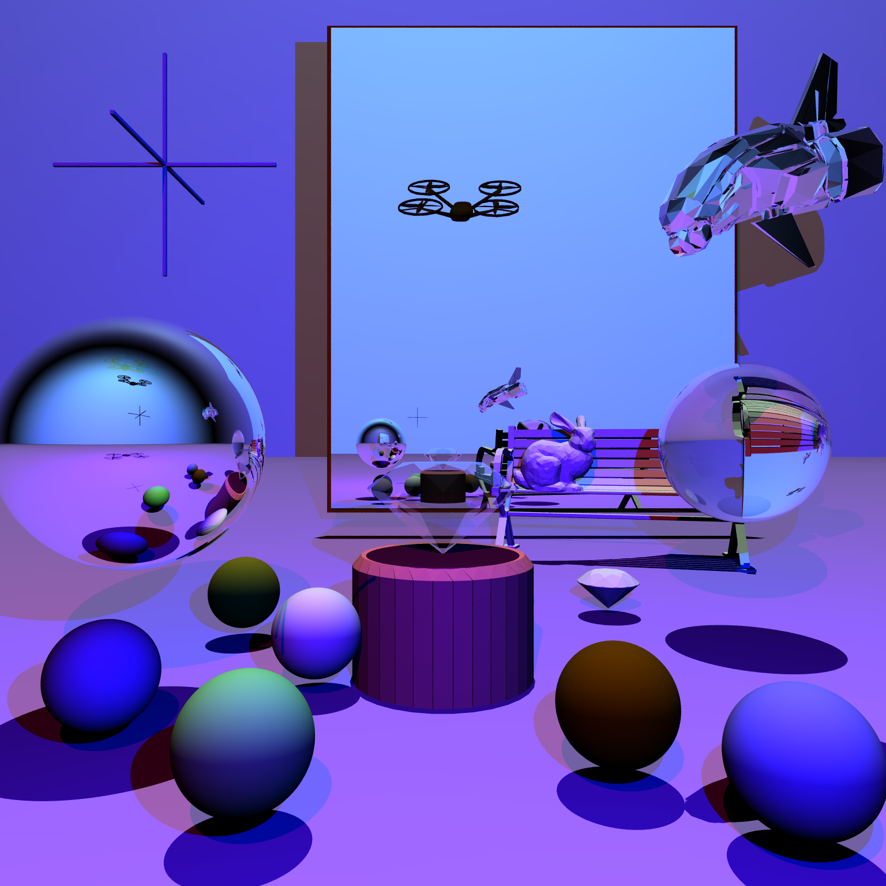

# COMP30019 Assignment 1 - Ray Tracer
This is your README.md... you should write anything relevant to your implementation here.

Please ensure your student details are specified below (*exactly* as on UniMelb records):

**Name:** NuoyanChen \
**Student Number:** 1074521 \
**Username:** NUOYANC \
**Email:** nuoyanc@student.unimelb.edu.au

## Completed stages

Tick the stages bellow that you have completed so we know what to mark (by editing README.md). At most **six** marks can be chosen in total for stage three. If you complete more than this many marks, pick your best one(s) to be marked!


##### Stage 1

- [x] Stage 1.1 - Familiarise yourself with the template
- [x] Stage 1.2 - Implement vector mathematics
- [x] Stage 1.3 - Fire a ray for each pixel
- [x] Stage 1.4 - Calculate ray-entity intersections
- [x] Stage 1.5 - Output primitives as solid colours

##### Stage 2

- [x] Stage 2.1 - Diffuse materials
- [x] Stage 2.2 - Shadow rays
- [x] Stage 2.3 - Reflective materials
- [x] Stage 2.4 - Refractive materials
- [x] Stage 2.5 - The Fresnel effect
- [x] Stage 2.6 - Anti-aliasing

##### Stage 3

- [ ] Option A - Emissive materials (+6)
- [ ] Option B - Ambient lighting/occlusion (+6)
- [x] Option C - OBJ models (+6)
- [ ] Option D - Glossy materials (+3)
- [ ] Option E - Custom camera orientation (+3)
- [ ] Option F - Beer's law (+3)
- [ ] Option G - Depth of field (+3)

*Please summarise your approach(es) to stage 3 here.*

My current implementation can take any blender obj file as input, \
given the model mesh is set to triangle faces or 'poke face'. The obj model is just a list of \
triangles, and with a bounding sphere which is calculated after read in all vertex. The intersect\
method check if a ray collide with the bounding sphere first, then go for the closest triangle that\
it hit.


## Final scene render

Be sure to replace ```./images/final_scene.png``` with your final render so it shows up here:


This render took **1065** minutes and **16.65** seconds on my PC. (approx 17.75 hours)


I used the following command to render the image exactly as shown:

```
dotnet run -- -f tests/final_scene.txt -o output.png -w 1536 -h 1536 -x 5 -v 65 -R 12 -T 32 -I 600
```

Below is a low quality version for markers to re-produce the image under 10 minutes.
```
dotnet run -- -f tests/final_scene.txt -o output.png -w 200 -h 200 -R 5 -v 65 -x 1
```

There are some customized flags.
```
-v Horizontal field of view in degrees
```
```
-R Maximum reflect/refract recursion depth.
```
```
-T Render threads square root number.
```

eg,set to -T 4, the image will be divided and rendered as (4x4) blocks, hence 16 threads. \
Normal case set to 4 is enough, but for image that contains some area that took very \
long time to render, higher number recommended.(to divide hardest part to smaller chunks)\
(see example with -T 4)


```
-I Real time rendering interval in seconds, set to 0 to disable.
 ```
If enabled this, progress
statistic will be shown, and 'realTime.png' will be rendered at each interval. see below example.


## Sample outputs

We have provided you with some sample tests located at ```/tests/*```. So you have some point of comparison, here are the outputs our ray tracer solution produces for given command line inputs (for the first two stages, left and right respectively):

###### Sample 1
```
dotnet run -- -f tests/sample_scene_1.txt -o images/sample_scene_1.png -x 4
```
<p float="left">
  
   
</p>

###### Sample 2

```
dotnet run -- -f tests/sample_scene_2.txt -o images/sample_scene_2.png -x 4
```
<p float="left">
  
   
</p>

## References

Fresnel calculation adopted from https://www.cnblogs.com/jietian331/p/5564901.html 

Sphere intersection adopted from https://www.cs.princeton.edu/courses/archive/fall00/cs426/lectures/raycast/sld013.htm


### Good reading material:

Working through a ray tracer, from the head of the xbox games studio: https://www.linkedin.com/pulse/writing-simple-ray-tracer-c-matt-booty/

*Ray Tracing in a Weekend*: https://raytracing.github.io/

Great walkthrough of some of the basic maths: https://blog.scottlogic.com/2020/03/10/raytracer-how-to.html

Scratchapixel: intro to ray tracing: https://www.scratchapixel.com/lessons/3d-basic-rendering/introduction-to-ray-tracing/how-does-it-work

## Grading Report
**Final Grade:** 20.0  
**Additional Comments:** -  
   
9:53:20 AM: Building project C:\Users\Alex\Documents\GitHub\Project-1-Auto-Test\projects\PinkPanther-ny  
9:53:22 AM: STDOUT: 

Microsoft (R) Build Engine version 16.10.2+857e5a733 for .NET
Copyright (C) Microsoft Corporation. All rights reserved.

  Determining projects to restore...
  Restored C:\Users\Alex\Documents\GitHub\Project-1-Auto-Test\projects\PinkPanther-ny\RayTracer.csproj (in 163 ms).
C:\Users\Alex\Documents\GitHub\Project-1-Auto-Test\projects\PinkPanther-ny\src\scene\Scene.cs(362,42): warning CS0168: The variable 'e' is declared but never used [C:\Users\Alex\Documents\GitHub\Project-1-Auto-Test\projects\PinkPanther-ny\RayTracer.csproj]
  RayTracer -> C:\Users\Alex\Documents\GitHub\Project-1-Auto-Test\projects\PinkPanther-ny\report\bin\RayTracer.dll

Build succeeded.

C:\Users\Alex\Documents\GitHub\Project-1-Auto-Test\projects\PinkPanther-ny\src\scene\Scene.cs(362,42): warning CS0168: The variable 'e' is declared but never used [C:\Users\Alex\Documents\GitHub\Project-1-Auto-Test\projects\PinkPanther-ny\RayTracer.csproj]
    1 Warning(s)
    0 Error(s)

Time Elapsed 00:00:01.29  
9:53:22 AM: Success building project.  
### Stage 1
9:53:22 AM: Running test: 1_1_camera @ tests\Stage_1\1_1_camera~30s~-w_400_-h_300.txt  
9:53:22 AM: Iteration timeout: 30 seconds  
9:53:22 AM: Additional args: -w 400 -h 300  
9:53:22 AM: STDOUT: 

Image rendered in 0.066 seconds.  
9:53:22 AM: Render completed in **0.22 seconds** user processor time (raw = 0.22s).  

<p float="left">


</p>

9:53:22 AM: Running test: 1_2_primitives @ tests\Stage_1\1_2_primitives~30s.txt  
9:53:22 AM: Iteration timeout: 30 seconds  
9:53:22 AM: Additional args: none  
9:53:23 AM: STDOUT: 

Image rendered in 0.193 seconds.  
9:53:23 AM: Render completed in **0.39 seconds** user processor time (raw = 0.39s).  

<p float="left">


</p>

9:53:23 AM: Running test: 1_3_depth @ tests\Stage_1\1_3_depth~30s.txt  
9:53:23 AM: Iteration timeout: 30 seconds  
9:53:23 AM: Additional args: none  
9:53:23 AM: STDOUT: 

Image rendered in 0.224 seconds.  
9:53:23 AM: Render completed in **0.41 seconds** user processor time (raw = 0.41s).  

<p float="left">


</p>

### Stage 1 Rubric
---
- [x] Stage Attempted (+12 marks)
---
- [x] Camera - FOV Incorrect (-1 marks)
- [x] Camera - Aspect Ratio Incorrect (-1 marks)
- [ ] Camera - Other Issue (minor) (-0.5 marks)
- [ ] Camera - Other Issue (major) (-1 marks)
---
- [ ] Shape - Plane Incorrect (-1 marks)
- [ ] Shape - Triangle Incorrect (-1 marks)
- [ ] Shape - Sphere Incorrect (-1 marks)
- [ ] Shape - Other Issue (minor) (-0.5 marks)
- [ ] Shape - Other Issue (major) (-1 marks)
---
- [ ] Depth - Wrong Order (1 case) (-1 marks)
- [ ] Depth - Wrong Order (2+ cases) (-2 marks)
- [ ] Depth - Other Issue (minor) (-0.5 marks)
- [ ] Depth - Other Issue (major) (-1 marks)
---
- [ ] Colour - Wrong Colour (1 case) (-1 marks)
- [ ] Colour - Wrong Colour (2+ cases) (-2 marks)
- [ ] Colour - Other Issue (minor) (-0.5 marks)
- [ ] Colour - Other Issue (major) (-1 marks)
---
- [ ] Other Issue #1 (major) (-1 marks)
- [ ] Other Issue #2 (major) (-1 marks)
- [ ] Other Issue #3 (minor) (-0.5 marks)
- [ ] Other Issue #4 (minor) (-0.5 marks)
---
**Additional Comments:** -  
  
---

  
### Stage 2
9:53:23 AM: Running test: 2_1_diffuse @ tests\Stage_2\2_1_diffuse~60s.txt  
9:53:23 AM: Iteration timeout: 60 seconds  
9:53:23 AM: Additional args: none  
9:53:24 AM: STDOUT: 

Image rendered in 0.221 seconds.  
9:53:24 AM: Render completed in **0.36 seconds** user processor time (raw = 0.36s).  

<p float="left">


</p>

9:53:24 AM: Running test: 2_2_reflection @ tests\Stage_2\2_2_reflection~60s.txt  
9:53:24 AM: Iteration timeout: 60 seconds  
9:53:24 AM: Additional args: none  
9:53:24 AM: STDOUT: 

Image rendered in 0.221 seconds.  
9:53:24 AM: Render completed in **0.42 seconds** user processor time (raw = 0.42s).  

<p float="left">


</p>

9:53:24 AM: Running test: 2_3_refraction @ tests\Stage_2\2_3_refraction~300s.txt  
9:53:24 AM: Iteration timeout: 300 seconds  
9:53:24 AM: Additional args: none  
9:53:28 AM: STDOUT: 

Image rendered in 3.577 seconds.  
9:53:28 AM: Render completed in **3.75 seconds** user processor time (raw = 3.75s).  

<p float="left">


</p>

9:53:28 AM: Running test: 2_4_sample @ tests\Stage_2\2_4_sample~300s~-x_3.txt  
9:53:28 AM: Iteration timeout: 300 seconds  
9:53:28 AM: Additional args: -x 3  
9:53:33 AM: STDOUT: 

Image rendered in 5.234 seconds.  
9:53:33 AM: Render completed in **5.36 seconds** user processor time (raw = 5.36s).  

<p float="left">


</p>

### Stage 2 Rubric
---
- [x] Stage Attempted (+9 marks)
---
- [ ] Diffuse Light - No Output (-1 marks)
- [ ] Diffuse Light - Incorrect Equation/Normals (-1 marks)
- [ ] Diffuse Light - Other Issue (major) (-1 marks)
- [ ] Diffuse Light - Other Issue (minor) (-0.5 marks)
---
- [ ] Shadows - No Output (-1 marks)
- [ ] Shadows - Multiple Light Issues (-0.5 marks)
- [ ] Shadows - Other Issue (major) (-1 marks)
- [ ] Shadows - Other Issue (minor) (-0.5 marks)
---
- [ ] Reflection - No Output (-2 marks)
- [ ] Reflection - Partial Output (-1 marks)
- [ ] Reflection - Reflecting Refraction Issue (major) (-1 marks)
- [ ] Reflection - Reflecting Refraction Issue (minor) (-0.5 marks)
- [ ] Reflection - Other Issue (major) (-1 marks)
- [ ] Reflection - Other Issue (minor) (-0.5 marks)
---
- [ ] Refraction - No Output (-2 marks)
- [ ] Refraction - Partial Output (-1 marks)
- [ ] Refraction - Recursivity Issue(s) (-0.5 marks)
- [ ] Refraction - Non-Sphere Issue(s) (-0.5 marks)
- [x] Refraction - Other Issue (major) (-1 marks)
- [ ] Refraction - Other Issue (minor) (-0.5 marks)
---
- [ ] Fresnel - No Output (-2 marks)
- [] Fresnel - Angle of Incidence Issue (-1 marks)
- [ ] Fresnel - Minor Artefact (-0.5 marks)
- [x] Fresnel - Major Artefact (-1 marks)
---
- [ ] Anti-aliasing - No Output (-1 marks)
- [ ] Anti-aliasing - Minor Artefact (-0.5 marks)
- [ ] Anti-aliasing - Major Artefact (-1 marks)
---
- [ ] Other Issue #1 (major) (-1 marks)
- [ ] Other Issue #2 (major) (-1 marks)
- [ ] Other Issue #3 (minor) (-0.5 marks)
- [ ] Other Issue #4 (minor) (-0.5 marks)
---
**Additional Comments:** -  
  
---

  
### Stage 3A
9:53:33 AM: Running test: 3A_1_baseline @ tests\Stage_3A\3A_1_baseline~60s.txt  
9:53:33 AM: Iteration timeout: 60 seconds  
9:53:33 AM: Additional args: none  
9:53:34 AM: STDOUT: 

Image rendered in 0.173 seconds.  
9:53:34 AM: Render completed in **0.36 seconds** user processor time (raw = 0.36s).  

<p float="left">


</p>

9:53:34 AM: Running test: 3A_2_emissive_low @ tests\Stage_3A\3A_2_emissive_low~1800s.txt  
9:53:34 AM: Iteration timeout: 1800 seconds  
9:53:34 AM: Additional args: none  
9:53:34 AM: STDOUT: 

Image rendered in 0.156 seconds.  
9:53:34 AM: Render completed in **0.33 seconds** user processor time (raw = 0.33s).  

<p float="left">


</p>

9:53:34 AM: Running test: 3A_3_emissive_med @ tests\Stage_3A\3A_3_emissive_med~1800s.txt  
9:53:34 AM: Iteration timeout: 1800 seconds  
9:53:34 AM: Additional args: none  
9:53:34 AM: STDOUT: 

Image rendered in 0.161 seconds.  
9:53:34 AM: Render completed in **0.3 seconds** user processor time (raw = 0.3s).  

<p float="left">


</p>

9:53:34 AM: Running test: 3A_4_emissive_high @ tests\Stage_3A\3A_4_emissive_high~1800s.txt  
9:53:34 AM: Iteration timeout: 1800 seconds  
9:53:34 AM: Additional args: none  
9:53:35 AM: STDOUT: 

Image rendered in 0.17 seconds.  
9:53:35 AM: Render completed in **0.31 seconds** user processor time (raw = 0.31s).  

<p float="left">


</p>

### Stage 3A Rubric
---
- [ ] Stage Attempted (+6 marks)
---
- [ ] Source - Invisible (-1 marks)
- [ ] Source - Emission Colour Incorrect (-1 marks)
- [ ] Source - Material Colour Incorrect (-1 marks)
- [ ] Source - Material Receives Illumination (-1 marks)
- [ ] Source - Other Issue (major) (-1 marks)
- [ ] Source - Other Issue (minor) (-0.5 marks)
---
- [ ] Soft Shadows - Not Present (all cases) (-5 marks)
- [ ] Soft Shadows - Not Present (one+ case) (-2 marks)
- [ ] Soft Shadows - Major Issue (-2 marks)
- [ ] Soft Shadows - Minor Issue (-1 marks)
---
- [ ] Noise - Incomprehensible Image (-6 marks)
- [ ] Noise - Not Justified (-2 marks)
- [ ] Noise - Partially Justified (-1 marks)
---
- [ ] Time - Complete Timeout (-6 marks)
- [ ] Time - Not Justified (-2 marks)
- [ ] Time - Partially Justified (-1 marks)
---
- [ ] Other Issue #1 (major) (-1 marks)
- [ ] Other Issue #2 (major) (-1 marks)
- [ ] Other Issue #3 (minor) (-0.5 marks)
- [ ] Other Issue #4 (minor) (-0.5 marks)
---
**Additional Comments:** -  
  
---

  
### Stage 3B
9:53:35 AM: Running test: 3B_1_ambient @ tests\Stage_3B\3B_1_ambient~3600s~-l.txt  
9:53:35 AM: Iteration timeout: 3600 seconds  
9:53:35 AM: Additional args: -l  
9:53:35 AM: STDOUT: 

Image rendered in 0.181 seconds.  
9:53:35 AM: Render completed in **0.34 seconds** user processor time (raw = 0.34s).  

<p float="left">


</p>

### Stage 3B Rubric
---
- [ ] Stage Attempted (+6 marks)
---
- [ ] Indirect Light - None (-6 marks)
- [ ] Indirect Light - Partial or Unrealistic (-3 marks)
- [ ] Indirect Light - Incorrect Colour(s) (-2 marks)
- [ ] Indirect Light - Other Issue (major) (-1 marks)
- [ ] Indirect Light - Other Issue (minor) (-0.5 marks)
---
- [ ] Noise - Incomprehensible Image (-6 marks)
- [ ] Noise - Not Justified (-2 marks)
- [ ] Noise - Partially Justified (-1 marks)
---
- [ ] Time - Complete Timeout (-6 marks)
- [ ] Time - Not Justified (-2 marks)
- [ ] Time - Partially Justified (-1 marks)
---
- [ ] Other Issue #1 (major) (-1 marks)
- [ ] Other Issue #2 (major) (-1 marks)
- [ ] Other Issue #3 (minor) (-0.5 marks)
- [ ] Other Issue #4 (minor) (-0.5 marks)
---
**Additional Comments:** -  
  
---

  
### Stage 3C
9:53:35 AM: Running test: 3C_1_baseline @ tests\Stage_3C\3C_1_baseline~1200s.txt  
9:53:35 AM: Iteration timeout: 1200 seconds  
9:53:35 AM: Additional args: none  
9:53:36 AM: STDOUT: 

Image rendered in 0.438 seconds.  
9:53:36 AM: Render completed in **0.58 seconds** user processor time (raw = 0.58s).  

<p float="left">


</p>

9:53:36 AM: Running test: 3C_2_obj @ tests\Stage_3C\3C_2_obj~1200s.txt  
9:53:36 AM: Iteration timeout: 1200 seconds  
9:53:36 AM: Additional args: none  
9:55:47 AM: STDOUT: 

Image rendered in 130.557 seconds.  
9:55:47 AM: Render completed in **2 minutes, 7 seconds** user processor time (raw = 127.22s).  

<p float="left">


</p>

9:55:47 AM: Running test: 3C_3_obj @ tests\Stage_3C\3C_3_obj~1200s.txt  
9:55:47 AM: Iteration timeout: 1200 seconds  
9:55:47 AM: Additional args: none  
9:57:44 AM: STDOUT: 

Image rendered in 117.402 seconds.  
9:57:44 AM: Render completed in **1 minute, 57 seconds** user processor time (raw = 117.55s).  

<p float="left">


</p>

### Stage 3C Rubric
---
- [x] Stage Attempted (+6 marks)
---
- [ ] Shape - Not Visible (-6 marks)
- [ ] Shape - Major Artefact(s) (-2 marks)
- [ ] Shape - Minor Artefact(s) (-1 marks)
- [x] Shape - RH Coordinate System (-0.5 marks)
---
- [ ] Lighting - Incorrect Normals (-2 marks)
- [x] Lighting - Unsmoothed Normals (-1 marks)
- [ ] Lighting - Material Issue(s) (-1 marks)
- [ ] Lighting - Other Issue (minor) (-0.5 marks)
- [ ] Lighting - Other Issue (major) (-1 marks)
---
- [ ] Reflection - Major Artefact(s) (-2 marks)
- [x] Reflection - Minor Artefact(s) (-1 marks)
- [ ] Reflection - Other Issue (minor) (-0.5 marks)
- [ ] Reflection - Other Issue (major) (-1 marks)
---
- [ ] Time - Bunny >5x Sphere (-0.5 marks)
- [ ] Time - Bunny >10x Sphere (-1 marks)
- [ ] Time - Bunny >25x Sphere (-2 marks)
- [x] Time - Bunny >100x Sphere (or downscale) (-3 marks)
- [ ] Time - Complete Timeout (-6 marks)
---
- [ ] Other Issue #1 (major) (-1 marks)
- [ ] Other Issue #2 (major) (-1 marks)
- [ ] Other Issue #3 (minor) (-0.5 marks)
- [ ] Other Issue #4 (minor) (-0.5 marks)
---
**Additional Comments:** -  
  The knob on the lid of the teapot was not reflected.
---

  
### Stage 3D
9:57:44 AM: Running test: 3D_1_glossy @ tests\Stage_3D\3D_1_glossy~1800s.txt  
9:57:44 AM: Iteration timeout: 1800 seconds  
9:57:44 AM: Additional args: none  
9:57:45 AM: STDOUT: 

Image rendered in 0.415 seconds.  
9:57:45 AM: Render completed in **0.53 seconds** user processor time (raw = 0.53s).  

<p float="left">


</p>

### Stage 3D Rubric
---
- [ ] Stage Attempted (+3 marks)
---
- [ ] Effect - Not Visible (-3 marks)
- [ ] Effect - Unconvincing (-2 marks)
- [ ] Effect - Partially convincing (-1 marks)
- [ ] Effect - Minor Issue/Artefact(s) (-0.5 marks)
---
- [ ] Technique - Overly Simple (-1 marks)
- [ ] Technique - Minor Issue (-0.5 marks)
- [ ] Technique - Major Issue (-1 marks)
---
- [ ] Time - Complete Timeout (-3 marks)
- [ ] Time - Not Justified (-2 marks)
- [ ] Time - Partially Justified (-1 marks)
---
- [ ] Other Issue #1 (major) (-1 marks)
- [ ] Other Issue #2 (major) (-1 marks)
- [ ] Other Issue #3 (minor) (-0.5 marks)
- [ ] Other Issue #4 (minor) (-0.5 marks)
---
**Additional Comments:** -  
  
---

  
### Stage 3E
9:57:45 AM: Running test: 3E_1_camera @ tests\Stage_3E\3E_1_camera~30s~--cam-pos_0,2,-0.5_--cam-axis_1,0,0_--cam-angle_45.txt  
9:57:45 AM: Iteration timeout: 30 seconds  
9:57:45 AM: Additional args: --cam-pos 0,2,-0.5 --cam-axis 1,0,0 --cam-angle 45  
9:57:45 AM: STDOUT: 

Image rendered in 0.144 seconds.  
9:57:45 AM: Render completed in **0.27 seconds** user processor time (raw = 0.27s).  

<p float="left">


</p>

9:57:45 AM: Running test: 3E_2_camera @ tests\Stage_3E\3E_2_camera~30s~--cam-pos_0,2,-0.5_--cam-axis_1,0,0_--cam-angle_-45.txt  
9:57:45 AM: Iteration timeout: 30 seconds  
9:57:45 AM: Additional args: --cam-pos 0,2,-0.5 --cam-axis 1,0,0 --cam-angle -45  
9:57:46 AM: STDOUT: 

Image rendered in 0.142 seconds.  
9:57:46 AM: Render completed in **0.23 seconds** user processor time (raw = 0.23s).  

<p float="left">


</p>

9:57:46 AM: Running test: 3E_3_camera @ tests\Stage_3E\3E_3_camera~30s~--cam-pos_0,0,-1_--cam-axis_0,0.707,0.707_--cam-angle_20.txt  
9:57:46 AM: Iteration timeout: 30 seconds  
9:57:46 AM: Additional args: --cam-pos 0,0,-1 --cam-axis 0,0.707,0.707 --cam-angle 20  
9:57:46 AM: STDOUT: 

Image rendered in 0.143 seconds.  
9:57:46 AM: Render completed in **0.28 seconds** user processor time (raw = 0.28s).  

<p float="left">


</p>

### Stage 3E Rubric
---
- [ ] Stage Attempted (+3 marks)
---
- [ ] Position - Incorrect (1 case) (-1 marks)
- [ ] Position - Incorrect (2+ cases) (-2 marks)
---
- [ ] Rotation - Wrong Angle (-1 marks)
- [ ] Rotation - Wrong Angle Direction (-1 marks)
- [ ] Rotation - Incorrect (1 case) (-1 marks)
- [ ] Rotation - Incorrect (2+ cases) (-2 marks)
---
- [ ] Time - Complete Timeout (-3 marks)
- [ ] Time - Not Justified (-2 marks)
- [ ] Time - Partially Justified (-1 marks)
---
- [ ] Other Issue #1 (major) (-1 marks)
- [ ] Other Issue #2 (major) (-1 marks)
- [ ] Other Issue #3 (minor) (-0.5 marks)
- [ ] Other Issue #4 (minor) (-0.5 marks)
---
**Additional Comments:** -  
  
---

  
### Stage 3F
9:57:46 AM: Running test: 3F_1_beers_room @ tests\Stage_3F\3F_1_beers_room~120s.txt  
9:57:46 AM: Iteration timeout: 120 seconds  
9:57:46 AM: Additional args: none  
9:57:47 AM: STDOUT: 

Image rendered in 1.34 seconds.  
9:57:47 AM: Render completed in **1.5 seconds** user processor time (raw = 1.5s).  

<p float="left">


</p>

9:57:47 AM: Running test: 3F_2_beers_pyramid @ tests\Stage_3F\3F_2_beers_pyramid~120s.txt  
9:57:47 AM: Iteration timeout: 120 seconds  
9:57:47 AM: Additional args: none  
9:57:51 AM: STDOUT: 

Image rendered in 2.998 seconds.  
9:57:51 AM: Render completed in **3.14 seconds** user processor time (raw = 3.14s).  

<p float="left">


</p>

### Stage 3F Rubric
---
- [ ] Stage Attempted (+3 marks)
---
- [ ] Colour - No Change (-3 marks)
- [ ] Colour - Hue Incorrect (-1 marks)
- [ ] Colour - Blending Issue (minor) (-1 marks)
- [ ] Colour - Blending Issue (major) (-2 marks)
- [ ] Colour - Absorbance Issue (minor) (-1 marks)
- [ ] Colour - Absorbance Issue (major) (-2 marks)
- [ ] Colour - Other Issue (minor) (-0.5 marks)
- [ ] Colour - Other Issue (major) (-1 marks)
---
- [ ] Shape - Sphere Issue (-1 marks)
- [ ] Shape - Non-Sphere Issue (-1 marks)
- [ ] Shape - Other Issue (minor) (-0.5 marks)
- [ ] Shape - Other Issue (major) (-1 marks)
---
- [ ] Time - Complete Timeout (-3 marks)
- [ ] Time - Not Justified (-2 marks)
- [ ] Time - Partially Justified (-1 marks)
---
- [ ] Other Issue #1 (major) (-1 marks)
- [ ] Other Issue #2 (major) (-1 marks)
- [ ] Other Issue #3 (minor) (-0.5 marks)
- [ ] Other Issue #4 (minor) (-0.5 marks)
---
**Additional Comments:** -  
  
---

  
### Stage 3G
9:57:51 AM: Running test: 3G_1_dof @ tests\Stage_3G\3G_1_dof~1800s~--aperture-radius_0.06_--focal-length_1.5.txt  
9:57:51 AM: Iteration timeout: 1800 seconds  
9:57:51 AM: Additional args: --aperture-radius 0.06 --focal-length 1.5  
9:57:51 AM: STDOUT: 

Image rendered in 0.416 seconds.  
9:57:51 AM: Render completed in **0.55 seconds** user processor time (raw = 0.55s).  

<p float="left">


</p>

### Stage 3G Rubric
---
- [ ] Stage Attempted (+3 marks)
---
- [ ] Aperture - None/Incomprehensible Output (-3 marks)
- [ ] Aperture - Incorrect Size (-1 marks)
- [ ] Aperture - Other Issue (major) (-1 marks)
- [ ] Aperture - Other Issue (minor) (-0.5 marks)
---
- [ ] Focal Length - Incorrect Distance (-1 marks)
- [ ] Focal Length - Other Issue (major) (-1 marks)
- [ ] Focal Length - Other Issue (minor) (-0.5 marks)
---
- [ ] Time - Complete Timeout (-3 marks)
- [ ] Time - Not Justified (-2 marks)
- [ ] Time - Partially Justified (-1 marks)
---
- [ ] Other Issue #1 (major) (-1 marks)
- [ ] Other Issue #2 (major) (-1 marks)
- [ ] Other Issue #3 (minor) (-0.5 marks)
- [ ] Other Issue #4 (minor) (-0.5 marks)
---
**Additional Comments:** -  
  
---

  
### Stage Final





### Stage Final Rubric
---
- [x] Final Image Attempted (+3 marks)
---
- [ ] Coverage - Little/None (-1 marks)
- [ ] Coverage - Partial (-0.5 marks)
---
- [ ] Quality - Little/None (-1 marks)
- [ ] Quality - Partial (-0.5 marks)
---
- [ ] Creativity - Little/None (-1 marks)
- [x] Creativity - Partial (-0.5 marks)
---
- [ ] Other - Repository Issue (minor) (-0.5 marks)
- [ ] Other - Repository Issue (major) (-1 marks)
- [ ] Other - README.md References Lacking (-1 marks)
- [ ] Other - README.md Utilised Incorrectly (-1 marks)
- [ ] Other - GitHub Not Utilised (-2 marks)
- [ ] Other - GitHub Incorrectly Utilised (-1 marks)
---
**Additional Comments:** -  
  
---

  
